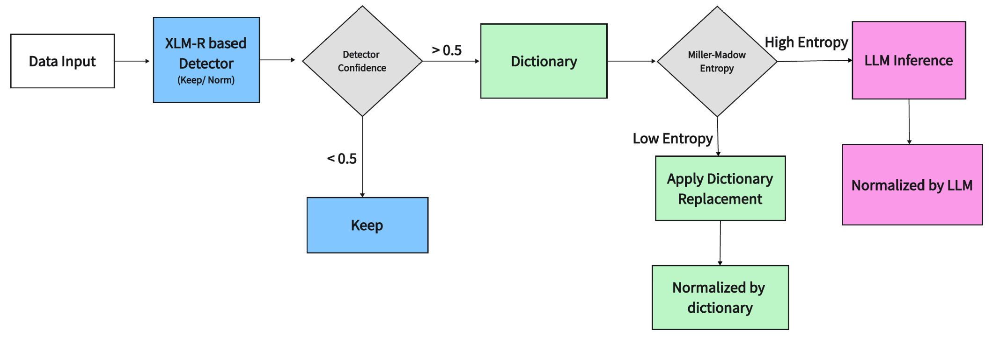
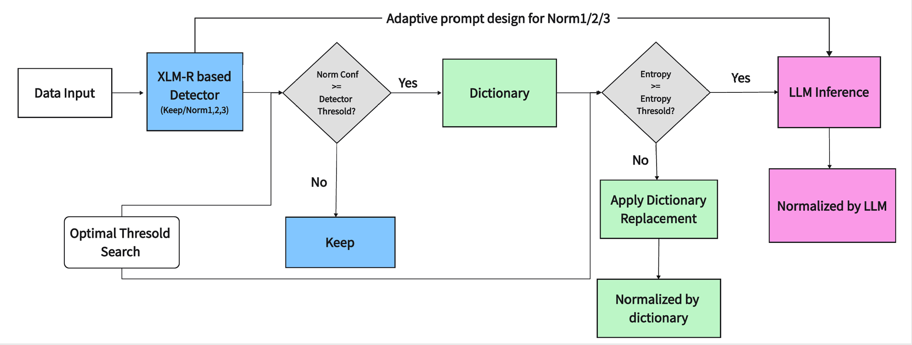

# Extending the MultiLexNorm++ Pipeline with Length-Aware Detection and Language-Specific Threshold Optimization

## Introduction

### Lexical Normalization

**Raw:** *Why do dese guys think they doin' summn?*

**Normalized:** *Why do these guys think they are doing something?*

### MultiLexNorm++

- A benchmark covering origin Indo-European and new Asian languages
- A three-stage normalization pipeline

**Challenge:** binary detection ignores output length + one fixed thresholds setting may not be optimal for all languages

**Our work:** length-aware detection + language-specific threshold optimization

## Method

### Reproduced Baseline

- We reproduced the original detector-dictionary-LLM pipeline

### Our Pipeline – Fine-grained Detector

- Train a length-aware detector to replace original binary classifier
- New possible labels: 0/ NORM_1/2/3+
- Normalize when sum of all norm labels >= detector threshold
- Build prompts with length-constraint for LLM inference

e.g.: "This word or phrase need to normalize into two words"

### Our Pipeline – Search Optimal Thresholds as Hyperparameters

- Grid-searched detector and entropy thresholds per language
- First run pipeline with lowest thresholds to maximize LLM candidates
- Cache first run outputs and reuse them for later combinations
- Select the combination with best ERR on the DEV set

## Experimental Setup

### Dataset

- MultiLexNorm++: 7 Indo-European languages + 5 Asian languages
- Training data: split into 90% TRAIN and 10% DEV
- Validation data: final evaluation

### Models

- Detectors: XLM-R trained with the same MaChAmp setup as baseline
- LLMs: Qwen3.5:9b and Deepseek-V4-Pro used for controlled comparison

### Threshold Search Grid

- Detector Thresholds: {0.1, 0.3, 0.5, 0.7, 0.9}
- Entropy Thresholds: {0.2, 0.5, 0.8, 1.1, 1.4, 1.7}

## Project Structure

- [`baseline_lrz`](baseline_lrz): reproduces the MultiLexNorm++ pipeline on LRZ. See the README in this directory for detailed usage instructions.
- [`our_pipeline_lrz`](our_pipeline_lrz): reproduces our improved pipeline on LRZ. See the README in this directory for detailed usage instructions.
- [`llm_pipeline`](llm_pipeline): reproduces the pipeline using either Ollama or API-based LLM inference. See the README in this directory for detailed usage instructions.
- [`previous_test`](previous_test): evaluates the ByT5-based UFAL model on the MultiLexNorm++ dataset. Usage instructions are provided in its `src` directory.
- [`results`](results): stores the CSV-formatted results of UFAL and the two pipelines.
- [`weerayut`](weerayut): contains the dataset used in this project, sourced from the MultiLexNorm++ paper and reorganized for convenient execution on LRZ.
