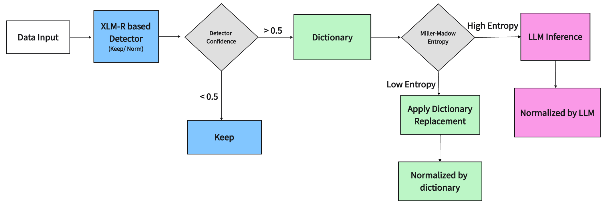
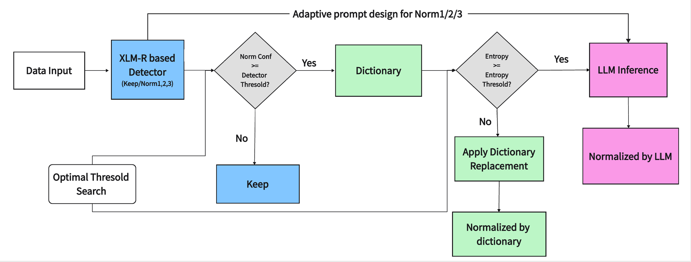
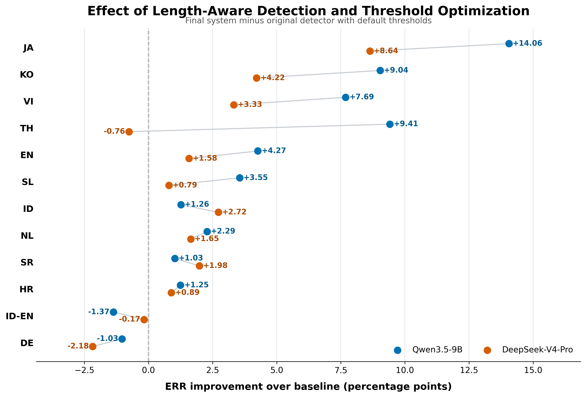

# Extending the MultiLexNorm++ Pipeline with Length-Aware Detection and Language-Specific Threshold Optimization

## Introduction

### Lexical Normalization

Lexical normalization converts noisy social media text into standard forms for downstream NLP tasks. For example:

```text
Raw:        Why do dese guys think they doin' summn?
Normalized: Why do these guys think they are doing something?
```

### Original [MultiLexNorm++](https://arxiv.org/abs/2601.16623)

- A lexical normalization benchmark covering Indo-European and Asian languages
- A three-stage pipeline: Detector → MFR Dictionary → LLM

**Limitations:** The detector ignores output length, and a fixed threshold configuration may not suit every language.

### Our work

We investigate two extensions to the pipeline:

- A **length-aware detector** that predicts the expected number of output words
- Language-specific **threshold optimization**

This module focuses primarily on Yujiaxuan Wang's contribution, including the pipeline implementation, threshold optimization, and the experimental analysis.


## Reproduced Pipeline

<p align="left">
  
</p>

The original detector–dictionary–LLM pipeline:

- Detect tokens that require normalization
- Handle reliable cases with a Most-Frequent-Replacement (MFR) dictionary
- Send the remaining cases to an LLM

---

## Language-Specific Threshold Optimization

<p align="left">
  
</p>

The reproduced baseline uses fixed values for two key thresholds:

- **Detector confidence score threshold:** controls which tokens are selected as normalization candidates.
- **Dictionary entropy threshold:** determines whether a candidate is replaced by the MFR dictionary or passed to the LLM.

The baseline uses fixed detector and dictionary-entropy thresholds for all languages.

We make both thresholds configurable and perform a 5 × 6 grid search per language:

```text
Detector threshold: 0.1, 0.3, 0.5, 0.7, 0.9
Entropy threshold:  0.2, 0.5, 0.8, 1.1, 1.4, 1.7
```

LLM outputs are cached and reused across threshold combinations to avoid repeated inference.

For each language, the best threshold pair is selected on the development set using ERR, with F1 as a secondary criterion.

---

## Results

### Ablation Study: 12 Languages × 3 LLMs

| Detector | Thresholds | Δ ERR (pp) | Δ F1 (pp) |
|---|---|---:|---:|
| Original | Original | Baseline | Baseline |
| Length-aware | Original | +0.19 | -0.45 |
| Original | Language-specific | **+3.91** | **+2.27** |
| Length-aware | Language-specific | +3.79 | +1.79 |

**Takeaway:** Language-specific threshold optimization is the primary source of improvement, while the length-aware detector provides smaller and model-dependent benefits.

### Threshold Optimization: by Language

<p align="left">
  
</p>

### Threshold Optimization: by Language Group

| Group | Datasets | Δ ERR (pp) | Δ F1 (pp) |
|---|---:|---:|---:|
| Asian (`id`, `ja`, `ko`, `th`, `vi`) | 5 | **+6.56** | **+3.12** |
| Indo-European | 7 | +2.01 | +1.67 |

---

## Experimental Setup

- **Dataset:** `weerayut/multilexnorm2026-dev-pub`; 12 language datasets.
- **Split:** 90% training / 10% development per language; separate validation data for final evaluation.
- **Detector:** XLM-RoBERTa via MaChAmp.
- **LLMs:** Qwen2.5-7B, Qwen3.5-9B, DeepSeek-V4-Pro; eight-shot prompting.
- **Metrics:** Error Reduction Rate (ERR) and F1.

Training data supplies detector training, the MFR dictionary, and prompt examples. Thresholds are selected on development data.

## Project Structure

```text
llm_pipeline/
├── src/                      # Pipeline, threshold search, evaluation
├── examples/                 # Sample records and saved validation outputs
├── models/machamp/configs/   # Detector configuration
├── requirements.txt
└── README.md
```


## Quick Start

Requires **Conda, Git, Ollama, network access, and a CUDA-compatible GPU at device `0`**. Run from the repository root.

### 1. Install Dependencies

```bash
cd llm_pipeline
conda create -n llm-pipeline python=3.10 -y
conda activate llm-pipeline
pip install -r requirements.txt
mkdir -p external
git clone https://github.com/machamp-nlp/machamp.git external/machamp
pip install -r external/machamp/requirements.txt
```

Skip the clone command if MaChAmp is already installed.

### 2. Prepare Models

```bash
python -m src.execute_prepare_detector --language en
ollama pull qwen3.5:9b
```

The first command prepares data and trains the detector. Ensure Ollama is serving at `localhost:11434`; otherwise run `ollama serve` in another terminal.

### 3. Run the Pipeline

```bash
python -m src.execute_run_pipeline --language en --model qwen3.5:9b
```

Default detector / entropy thresholds: `0.5 / 0.5`.
Results: `data/qwen3.5:9b/en_0.5_0.5/evaluation_summary_en.json`.

### 4. Search Thresholds

```bash
python -m src.search_thresholds --language en --model qwen3.5:9b
```

Outputs: `data/qwen3.5:9b/en_thresholds/`. Add `--check-cache` to reuse existing caches. For other options, run the corresponding module with `--help`.
